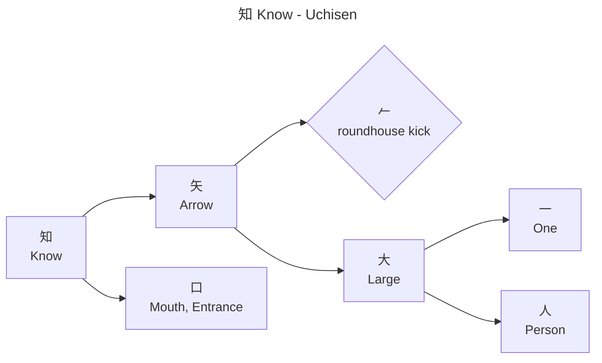
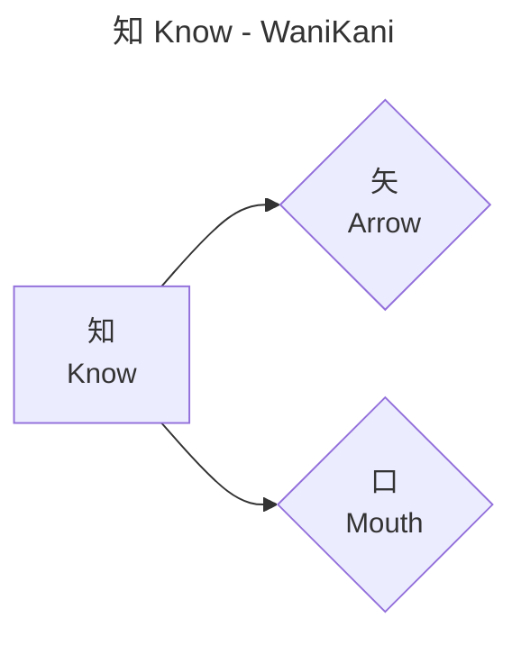
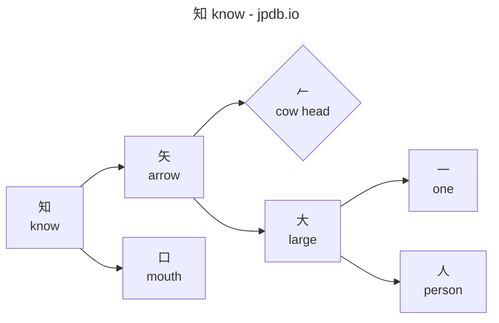

# Character decomposition graph generator
GenerateCharacterDecompGraph.ps1 script generates kanji character decomposition graphs in Mermaid format.

## Usage
```powershell
GenerateCharacterDecompGraph.ps1 -Character <string> [-Source <source[]>] [-WaniKaniApiToken <token>] [-Path <output-path>]
```

## Parameters
- `-Character` — A string containing one or more kanji characters. Non-kanji characters (punctuation, numbers, Latin letters, kana, etc.) are ignored. A graph is generated for each kanji character in the string.
- `-Source` — Optional. One or more decomposition sources: "uchisen", "wanikani", "jpdb". If omitted, all sources are used. Each character is processed for each source (outer loop is characters, inner loop is sources).
- `-Path` — Optional output path. If omitted, graphs are written to standard output.
- `-WaniKaniApiToken` — API token for WaniKani. If not provided, falls back to the `WANIKANI_API_TOKEN` environment variable. Required when wanikani is included in `-Source` (or when `-Source` is omitted).

## Behavior
When `-Path` is specified, behavior varies by path type:
- If <output-path> refers to a directory, a "<kanji>-<source>.mermaid" file is created for each character/source combination
- If <output-path> refers to a Mermaid file (.mermaid), graphs are written to this file (separated by blank lines for multiple graphs)
- If <output-path> refers to a Markdown file (.md), each graph is appended with a preceding newline and surrounding ```mermaid code block. When multiple sources are used, a `# <character>` heading is inserted before the graphs for each character.

When `-Path` is omitted, graphs are written to standard output (separated by blank lines for multiple graphs).

## Sources

### Uchisen
Looks up kanji on uchisen.com and recursively extracts the decomposition into primes and compound kanji components. Primes use diamond `{}` shape and kanji use rectangle `[]` shape.

### WaniKani
Uses the WaniKani API (v2) to look up kanji and extract their radical components. Decomposition is single-level only (kanji → radicals, no recursion). Radicals use diamond `{}` shape and kanji use rectangle `[]` shape. If a radical has the same name as the root kanji (self-decomposition), it is skipped.

### jpdb
Looks up kanji on jpdb.io and recursively extracts the decomposition into components. Characters in the standard CJK Unified Ideographs range are treated as kanji (rectangle `[]` shape) and recursed into; characters outside that range (e.g., CJK Extension B) are treated as primes (diamond `{}` shape). All component URLs use the `/kanji/` path on jpdb.io. Names are lowercase as provided by jpdb.

## Prime Unicode characters

The `uchisen-primes.yaml` file (in the same directory as the script) provides Unicode characters for uchisen primes, which are displayed as SVG images on the website and cannot be scraped directly. The file uses simple `key: value` format:

```yaml
roundhouse kick: 𠂉
```

When the script runs, it loads the file and uses any mapped characters in the graph output. If a prime is encountered at runtime that is not already in the file, a new entry is added with a blank value. The updated file is written back after each run, so the user can fill in missing values offline and re-run the script.

The graph should follow the format below.

## Example graph for kanji character `知`

### Uchisen


### WaniKani


### jpdb

