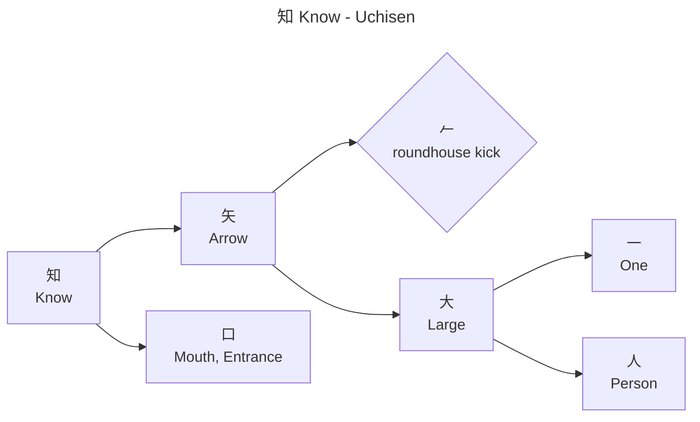

# Character decomposition graph generator
GenerateCharacterDecompGraph.ps1 script generates kanji character decomposition graphs in Mermaid format.

## Usage
```powershell
GenerateCharacterDecompGraph.ps1 -Character <string> -Source uchisen [-Path <output-path>]
```

## Parameters
- `-Character` — A string containing one or more kanji characters. Non-kanji characters (punctuation, numbers, Latin letters, kana, etc.) are ignored. A graph is generated for each kanji character in the string.
- `-Source` — The decomposition source to use. Currently only "uchisen" is supported.
- `-Path` — Optional output path. If omitted, graphs are written to standard output.

## Behavior
When `-Path` is specified, behavior varies by path type:
- If <output-path> refers to a directory, a "<kanji>-<source>.mermaid" file is created in the directory for each character
- If <output-path> refers to a Mermaid file (.mermaid), graphs are written to this file (separated by blank lines for multiple characters)
- If <output-path> refers to a Markdown file (.md), each graph is appended with a preceding newline and surrounding ```mermaid code block

When `-Path` is omitted, graphs are written to standard output (separated by blank lines for multiple characters).

The only supported source right now is "uchisen". The script should look up the specified kanji character on the uchisen website and recursively extract the decomposition of the character to primes and compound kanji components.

## Prime Unicode characters

The `uchisen-primes.yaml` file (in the same directory as the script) provides Unicode characters for uchisen primes, which are displayed as SVG images on the website and cannot be scraped directly. The file uses simple `key: value` format:

```yaml
roundhouse kick: 𠂉
```

When the script runs, it loads the file and uses any mapped characters in the graph output. If a prime is encountered at runtime that is not already in the file, a new entry is added with a blank value. The updated file is written back after each run, so the user can fill in missing values offline and re-run the script.

The graph should follow the format below.

## Example graph for kanji character `知`

